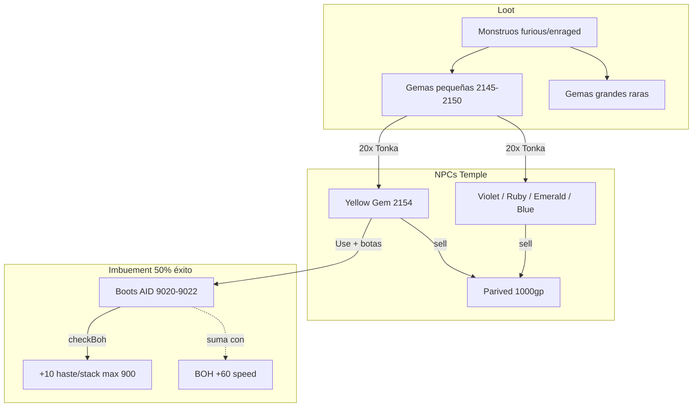

# Sistema de gemas e imbuements

Documentación técnica del sistema de gemas en YurOTS: obtención, economía, imbuements y efectos en combate/movimiento.

## Resumen

Las gemas son progresión lateral opcional:

1. **Gemas pequeñas** (2145–2150) dropean de monstruos fuertes (variantes *angry*, *furious*, *enraged*).
2. **Tonka** fusiona 20 pequeñas → 1 gema grande imbuable.
3. **Parived** compra gemas al jugador (salida económica).
4. **Imbuements**: usar la gema grande con el slot correcto equipado; el efecto queda guardado en el `actionid` del ítem.

Archivos de referencia:

| Archivo | Rol |
|---------|-----|
| `server/YurOTS/ots/data/actions/scripts/gem_imbue.lua` | Lógica de imbuir (validación, stacks, fail chance) |
| `server/YurOTS/ots/source/player.cpp` (`checkBoh`, `getEffectiveMagLevel`, `getAttackDelayMs`) | Aplicación de efectos al jugador |
| `server/YurOTS/ots/source/creature.h` (`getNormalSpeed`) | Fórmula de velocidad (BOH + yellow gem) |
| `server/YurOTS/ots/source/const76.h` | IDs de ítems y rangos de `actionid` |
| `server/YurOTS/ots/source/item.cpp` | Descripciones al mirar gemas/ítems imbuidos |
| `server/YurOTS/ots/data/npc/scripts/tonka.lua` | Fusión 20→1 |
| `server/YurOTS/ots/data/npc/scripts/parived.lua` | Venta al NPC |

---

## Catálogo de ítems

### Gemas pequeñas (loot de monstruos)

| ID | Nombre | Uso |
|----|--------|-----|
| 2145 | Small Diamond | Tonka → Blue Gem (2158) |
| 2146 | Small Sapphire | Tonka → **Yellow Gem** (2154) |
| 2147 | Small Ruby | Tonka → Big Ruby (2156) |
| 2149 | Small Emerald | Tonka → Big Emerald (2155) |
| 2150 | Small Amethyst | Tonka → Violet Gem (2153) |

### Gemas grandes (imbuibles)

| ID | Nombre | Origen | Slot | Efecto |
|----|--------|--------|------|--------|
| 2154 | **Yellow Gem** | 20× Small Sapphire | Botas | +10 haste/stack (máx. 3) |
| 2153 | Violet Gem | 20× Small Amethyst | Wand/rod | +1 ML/stack (máx. 4) |
| 2156 | Big Ruby | 20× Small Ruby | Arma (no wand) | +5% / +9% / +16% attack speed |
| 2155 | Big Emerald | 20× Small Emerald | Armadura | +1 sword/club/axe/dist por stack (máx. 4, P/K) |
| 2158 | **Blue Gem** | 20× Small Diamond | **Crystal Arrow** (`2352`) | +5% attack speed/stack (máx. 5) |

### Gemas sin imbuement

| ID | Nombre | Origen | Uso |
|----|--------|--------|-----|
| 2151 | Talon | Loot | Vender a Parived |
| 2157 | Gold Nugget | Loot | Vender a Parived |
| 2159 | Scarab Coin | Loot | Vender a Parived |

---

## Obtención de gemas

### Loot de monstruos

Las gemas pequeñas están en las tablas de loot XML de monstruos fuertes, sobre todo variantes **furious** y **enraged** (hydra, dragon lord, warlock, black knight, etc.). Cada monstruo define sus propias probabilidades por tipo de gema.

Monstruos con prefijo de furia (`angry`, `furious`, `enraged`) tienen multiplicador de chance en gemas pequeñas (`monsters.cpp`):

| Prefijo | Multiplicador |
|---------|---------------|
| angry | ×1.00 (sin bonus extra; chances base en XML) |
| furious | ×2.40 |
| enraged | ×3.20 |

Los **rage trolls** (`angry/furious/enraged troll`) tienen además un fallback: si el cadáver no tiene ninguna gema pequeña, se añade una aleatoria.

Las gemas grandes (yellow, violet, big ruby, big emerald, blue gem, etc.) pueden dropear directamente como loot raro (`game.cpp` → `isRareLootItem`).

### NPC Tonka (temple, piso 6 — x=132, y=29)

Intercambio **20 gemas pequeñas del mismo tipo → 1 gema grande**:

```
exchange sapphire  → Yellow Gem
exchange amethyst  → Violet Gem
exchange ruby      → Big Ruby
exchange emerald   → Big Emerald
exchange diamond   → Blue Gem (imbue crystal arrow)
```

Requiere confirmación (`yes` / `si`). Si no hay espacio en backpack, devuelve las 20 pequeñas.

### NPC Parived (temple, piso 7)

Compra gemas al jugador. Precios actuales (`parived.lua`):

| Ítem | Precio |
|------|--------|
| Small Amethyst | 200 gp |
| Small Emerald / Ruby / Sapphire | 250 gp |
| Small Diamond | 300 gp |
| Talon | 320 gp |
| Scarab Coin | 100 gp |
| **Yellow Gem** | **1.000 gp** |
| Blue Gem | 5.000 gp |
| Violet Gem / Big Emerald / Big Ruby / Gold Nugget | 10.000 gp |

Comandos: `sell ruby`, `sell 3 amethyst`, `sell all`, `list`.

---

## Mecánica de imbuement

### Cómo imbuir

1. Equipar el ítem en el slot correcto.
2. **Usar** la gema grande (action en `actions.xml` → `gem_imbue.lua`).
3. Si tiene éxito: la gema se consume, el `actionid` del ítem sube un nivel de stack, y se recalculan stats/velocidad.

### Probabilidad de fallo

```lua
IMBUE_FAIL_CHANCE = 50  -- gem_imbue.lua
```

`math.random(1, 100) <= 50` → **falla** (50% de probabilidad). Al fallar:

- Se pierde la gema.
- Efecto visual de fallo (magic effect 2).
- Mensaje: *"The imbuement failed and the gem crumbled."*

### Persistencia

El imbue se guarda en el **`actionid`** del ítem. Si pierdes o tradeas el ítem, el imbue viaja con él. Al mirar el ítem (`item.cpp`) se muestra el estado imbuido.

### Rangos de actionid

| Gema | Rango AID | Stacks |
|------|-----------|--------|
| Yellow (haste) | 9020 – 9022 | 1 / 2 / 3 |
| Violet (ML) | 9030 – 9033 | 1 / 2 / 3 / 4 |
| Big Ruby (attack speed) | 9040 – 9042 | 1 / 2 / 3 |
| Big Emerald (skills) | 9050 – 9053 | 1 / 2 / 3 / 4 |
| Nightglass (ruby special) | 9060 – 9064 | 1 … 5 |
| Crystal Arrow (blue gem) | 9070 – 9074 | 1 … 5 |

Legacy: AID `9041` en armadura cuenta como 3 stacks de emerald (compatibilidad con datos viejos).

### Conflictos entre imbuements

- **Arma + Big Ruby**: bloqueada si el ítem ya tiene otro imbue (AID ≥ 9020), salvo que ya tenga stacks ruby (9040–9042).
- **Armadura + Big Emerald**: bloqueada si AID está entre 9020–9042 (excepto legacy 9041).
- **Yellow en botas**, **Violet en wand**, **Blue en crystal arrow** no comparten slot/ítem; no hay conflicto directo.
- **Crystal Arrow** no acepta Big Ruby (excluida en Lua/C++); solo Blue Gem.

Tras imbuir, se llama `doPlayerCheckFeetSpeed(cid)` → `Player::checkBoh()` para refrescar velocidad, ML efectivo, attack delay y skills.

---

## Yellow Gem (2154) — detalle

### Cadena completa

```
Small Sapphire (2146)  ×20  ──Tonka──►  Yellow Gem (2154)  ──Use──►  Botas imbuidas
```

### Botas válidas

Solo estas botas aceptan imbuement (`gem_imbue.lua` → tabla `BOOTS`):

| ID | Nombre |
|----|--------|
| 2195 | Boots of Haste (BOH) |
| 2642 | Sandals |
| 2643 | Leather Boots |
| 2644 | Bunny Slippers |
| 2645 | Steel Boots |
| 2646 | Golden Boots |
| 3982 | Crocodile Boots |

Si no llevas botas de esa lista: *"Wear boots to imbue them."*

### Stacks y actionid

| Stacks | ActionID | Haste total en botas |
|--------|----------|----------------------|
| 0 | 0 (sin imbue) | 0 |
| 1/3 | 9020 | +10 |
| 2/3 | 9021 | +20 |
| 3/3 | 9022 | +30 |

Al llegar a 3/3: *"Boots already have 3/3 haste imbuements."*

### Efecto en velocidad (C++)

Constante: `HASTE_ENCHANT_SPEED = 10` (`const76.h`).

`Player::checkBoh()` lee los stacks del ítem en slot pies:

```cpp
int hasteNow = hasteStacksFromAid(items[SLOT_FEET]->getActionId());
// AID 9020→1 stack, 9021→2, 9022→3
hasteEnchantStacks = hasteNow;
```

La velocidad base se calcula en `Creature::getNormalSpeed()` (`creature.h`):

```cpp
// Con YUR_BOH y YUR_RINGS_AMULETS:
s = min(900, 220 + 2 * (level + 30*boh + 30*timeRing - 1));
if (hasteEnchantStacks > 0)
    s = min(900, s + HASTE_ENCHANT_SPEED * hasteEnchantStacks);
```

**Componentes de velocidad:**

| Fuente | Efecto en fórmula |
|--------|-------------------|
| Nivel | `+2` por nivel (dentro del paréntesis) |
| BOH equipado | `+30` al término de nivel → **+60 speed** efectivo (`2×30`) |
| Time Ring | `+30` al término de nivel → **+60 speed** efectivo |
| Yellow Gem | `+10` plano por stack (hasta +30 con 3 stacks) |
| Tope | **900** speed máximo |

**Importante:** Yellow Gem y BOH **se suman**. Un personaje con BOH + 3 stacks de yellow obtiene el bonus de BOH en la fórmula base **más** +30 flat de haste enchant.

### Ejemplo numérico (nivel 80, sin time ring)

| Configuración | Cálculo base | + Yellow | Total |
|---------------|--------------|----------|-------|
| Sin BOH, 0 stacks | 220 + 2×79 = **378** | — | 378 |
| Sin BOH, 3 stacks | 378 | +30 | **408** |
| Con BOH, 0 stacks | 220 + 2×(80+30-1) = **438** | — | 438 |
| Con BOH, 3 stacks | 438 | +30 | **468** |

### Flujo al imbuir (yellow)

```
onUse Yellow Gem
  ├─ ¿Botas equipadas y en lista BOOTS? ──no──► cancel
  ├─ ¿Stacks < 3? ──no──► "Boots already have 3/3..."
  ├─ rollImbueFailure (50%) ──falla──► pierde gema, sin stack
  └─ éxito:
       ├─ actionid → 9020 / 9021 / 9022
       ├─ doPlayerCheckFeetSpeed → checkBoh()
       └─ mensaje: "Boots imbued with haste (N/3)."
```

---

## Resto de gemas imbubles

### Violet Gem (2153) → Wand/Rod

- **Slot:** mano derecha o izquierda, solo wands/rods (IDs 2181–2191 en Lua).
- **Efecto:** +1 ML efectivo por stack (`getEffectiveMagLevel()` = `maglevel + imbueWandMl`).
- **Máx.:** 4 stacks (AID 9030–9033).

### Big Ruby (2156) → Arma

- **Slot:** mano derecha o izquierda; cualquier arma excepto wands, rods, escudos y ítems en lista `NOT_WEAPONS`.
- **Efecto:** reduce delay entre ataques (`getAttackDelayMs()`).
- **Base:** `PLAYER_ATTACK_DELAY_MS` = 1333 ms (`2000 × 100 / 150`).

| Stacks | Bonus speed | Delay por golpe |
|--------|-------------|-----------------|
| 1/3 | +5% | ~1266 ms |
| 2/3 | +9% | ~1212 ms |
| 3/3 | +16% | ~1120 ms |

### Big Emerald (2155) → Armadura

- **Slot:** armadura (slot 4).
- **Efecto:** +1 sword, club, axe y distance **por stack**.
- **Restricción:** solo **Paladin** y **Knight** (incluye promoted: Royal Paladin / Elite Knight) vía `isKnightOrPaladinFamily()` en `getSkill`.
- **Máx.:** 4 stacks (AID 9050–9053).
- **Stacking (debe sumar):** skill ring (+4 axe/sword/club o +6 fist power) + emerald stacks + Crimson Helmet (+1) + `tempoBuff` si aplica. Ejemplo: axe skill base `B` + axe ring + emerald 3/4 + crimson = **`B+8`**.
- **Bug jul 2026 (corregido):** `getSkill()` hacía early `return base + bonus` por fuente; ring ocultaba emerald/crimson, y emerald ocultaba crimson/`tempoBuff`. Fix: acumular como `getEffectiveMagLevel()` (ML).

### Blue Gem (2158) → Crystal Arrow

- **Cadena:** 20× Small Diamond → Tonka → Blue Gem → use con **crystal arrow** (`2352`) equipada.
- **Efecto:** +5% attack speed por stack (máx. 5 → +25%, delay ~1000 ms).
- **AID:** 9070–9074.
- **Fail:** 50% (igual que yellow/violet/ruby/emerald).
- **Doc dedicado:** [`CRYSTAL_ARROW.md`](CRYSTAL_ARROW.md).

---

## Descripciones en juego

Al mirar una gema grande (`item.cpp` → `appendGemUseDescription`):

- **Yellow Gem:** *"Imbue: use on equipped boots (+10 haste/stack, max 3). Stacks with BOH."*
- **Small Sapphire:** *"Tonka: trade 20 for a yellow gem (imbue boots)."*
- **Blue Gem:** *"Imbue: use on equipped crystal arrow (+5% attack speed/stack, max 5)."*
- **Small Diamond:** *"Tonka: trade 20 for a blue gem (imbue crystal arrow)."*

En botas ya imbuidas:

- *"Imbued: +10 haste (1/3)."* … hasta *"+30 haste (3/3)."*

---

## Diagrama del sistema



---

## Notas de balance y mantenimiento

- El **50% de fallo** hace que el coste esperado de un stack completo sea ~2 gemas por nivel (media geométrica).
- La **Yellow Gem** es la gema grande más barata en Parived (1k vs 10k de violet/ruby/emerald), coherente con ser la más accesible vía sapphire drops.
- `docs/GEMS.md` anterior listaba yellow a 10k en Parived; el precio real en código es **1.000 gp**.
- `OTINFO` menciona Big Ruby como +15% flat; el código usa **+5% / +9% / +16%** escalonado por stack.
- Cambios de balance: editar `IMBUE_FAIL_CHANCE`, `HASTE_ENCHANT_SPEED`, tablas `BOOTS`/`WANDS` en Lua, o rangos AID en `const76.h`.
