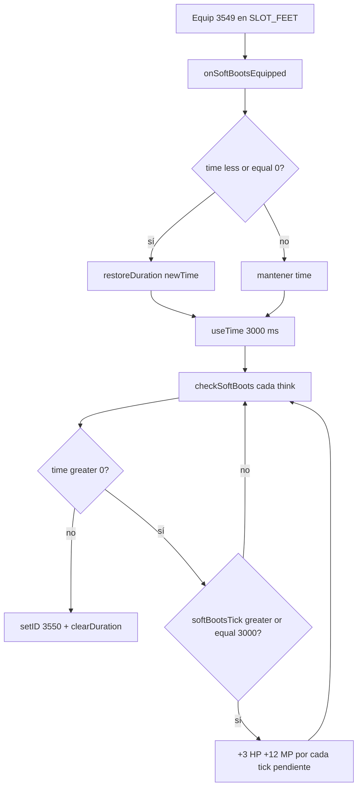

# Soft Boots — regen y desgaste

Documentación del comportamiento **actual** en YurOTS / Retro76.

> **TL;DR:** Soft boots (`3549`) equipadas en pies regeneran **+3 HP** y **+12 MP** cada **3 s**, duran **4 h** de uso, y al agotarse pasan a worn soft boots (`3550`). Solo funciona equipadas (`SLOT_FEET`). Flag de compilación: `YUR_SOFT_BOOTS`.

---

## Resumen

| Campo | Valor |
|-------|--------|
| Soft boots | `3549` (`ITEM_SOFT_BOOTS`) |
| Worn soft boots | `3550` (`ITEM_WORN_SOFT_BOOTS`) |
| Slot | `SLOT_FEET` (pies) |
| Peso | `8.0` oz (`items.xml`) |
| Duración | `14400000` ms = **4 horas** (`time` en `items.xml`) |
| Regen | cada `3000` ms: **+3 HP**, **+12 MP** |
| Penalidad al equipar | `3000` ms de duración consumidos al ponerlas |
| Al agotarse | `setID(3550)` + `clearDuration()` + refresh inventory |
| Imbue Yellow Gem | **No** (no están en tabla `BOOTS` de `gem_imbue.lua`) |
| NPC compra/venta/repair | **No** hay en data actual |

Throughput aproximado con soft equipadas: **~60 HP/min** y **~240 MP/min** (20 ticks/min × 3 / 12).

---

## Qué hacen (gameplay)

1. El jugador equipa soft boots (`3549`) en el slot de pies.
2. Al equipar: si el item no tiene tiempo (`getTime() <= 0`), se restaura la duración completa (`newTime` del tipo); luego se aplica la penalidad de equip (`SOFT_BOOTS_EQUIP_PENALTY_MS` = 1 tick).
3. Mientras estén equipadas, cada tick del game loop llama `Player::checkSoftBoots()`:
   - consume duración (`useTime(thinkTicks)`);
   - cada 3 s suma mana/HP (sin pasar del max); si el think se atrasa, el `while` aplica varios ticks de catch-up;
   - si la duración llega a 0 → transforman a worn (`3550`).
4. Al desequipar pies: se resetea el acumulador interno `softBootsTick` (no se pierde el `time` restante del item).
5. El `time` del item se persiste en el XML del player (igual que rings con duración).

El look muestra minutos restantes / “brand new” vía el mismo path de items con `time` (`item.cpp`, bloque `YUR_RINGS_AMULETS`).

---

## Constantes C++

Definidas en `server/YurOTS/ots/source/const76.h`:

```cpp
ITEM_SOFT_BOOTS       = 3549
ITEM_WORN_SOFT_BOOTS  = 3550

SOFT_BOOTS_INTERVAL_MS      3000
SOFT_BOOTS_MANA_GAIN        12
SOFT_BOOTS_HP_GAIN          3
SOFT_BOOTS_DURATION_MS      (240 * 60 * 1000)  // 4 h — documentativo; la duración real la pone items.xml
SOFT_BOOTS_EQUIP_PENALTY_MS 3000              // 1 tick de regen
```

Compilación: `-DYUR_SOFT_BOOTS` en `server/YurOTS/ots/source/Makefile` (activo).

---

## Archivos clave

| Archivo | Rol |
|---------|-----|
| `source/const76.h` | IDs y macros de balance |
| `source/player.h` / `player.cpp` | `onSoftBootsEquipped`, `checkSoftBoots`, hooks en `onThingMove` |
| `source/game.cpp` | llama `checkSoftBoots(thinkTicks)` en el think del player |
| `data/items/items.xml` | `time="14400000"` y peso (`items-zagan-test.xml` igual) |
| `data/items/items.otb` | nombres OTB: `soft boots` / `worn soft boots` |
| `OTINFO` | resumen de feature para ops |

### Hooks de equip/desequip (revisión)

| Camino | Soft boots |
|--------|------------|
| inventory → inventory | `onSoftBootsEquipped` si `toSlot==FEET`; reset tick si sale de pies |
| container → inventory | `onSoftBootsEquipped` si entra a pies |
| ground → inventory | `onSoftBootsEquipped` si entra a pies |
| inventory → container / ground | reset `softBootsTick` si sale de pies |
| Login con soft ya en pies | regen arranca en `checkSoftBoots` (sin penalidad de equip) |

---

## Flujo



---

## Obtención / economía

| Fuente | Detalle |
|--------|---------|
| NPC | Ninguno vende, compra ni repara soft/worn |
| Loot | `deathslicer.xml` dropea **worn** `3550` con `chance="2000"` (no soft nuevas) |
| Repair | No hay script/C++ que convierta `3550` → `3549` |

Una vez worn, el item deja de regenerar. Soft nuevas dependen de GM/admin o de lo que haya en data de jugadores/casas.

---

## Qué no hacen

- No dan haste ni speed (eso es BOH / Yellow Gem en otras botas).
- No regeneran si están en backpack o depot: solo equipadas.
- No aceptan Yellow Gem (`gem_imbue.lua` → `BOOTS` no incluye `3549`).
- Worn (`3550`) no tienen `time` ni regen.

---

## Pitfall: IDs 3549/3550 también aparecen como “door”

En este servidor el OTB nombra `3549`/`3550` como soft/worn boots, **pero** la data de puertas aún los referencia:

- `items.xml` (más abajo) marca `door="1"` otra vez para `3549`/`3550` → el tipo queda con `isDoor=true` **además** de `newTime`/weight de soft boots (el XML merge por id no borra `time`).
- `actions.xml`: `3549` → `leveldoor.lua`, `3550` → `door.lua`.
- `door.lua` transforma `3549`↔`3550` como puerta abierta/cerrada.

**Implicación:** usar (Use) un item `3549`/`3550` en el mapa puede disparar lógica de puerta; el gameplay de regen vive en C++ al equipar, no en esas actions. No reasignar esos IDs ni “limpiar” las doors a ciegas sin auditar el mapa.

---

## Cómo tocar balance

| Cambio | Dónde |
|--------|--------|
| HP/MP por tick o intervalo | `SOFT_BOOTS_*` en `const76.h` → **rebuild C++** |
| Duración total | `time` en `items.xml` / `items-zagan-test.xml` (ms) → reinicio OT |
| Penalidad al equipar | `SOFT_BOOTS_EQUIP_PENALTY_MS` → rebuild |
| Permitir Yellow Gem | agregar `[3549] = true` en `BOOTS` de `gem_imbue.lua` |

Tras rebuild C++: `docker compose -f docker-compose.prod.yml up -d yurots` + `python3 scripts/ot-probe.py 127.0.0.1 7171`.

### Historial de balance

| Fecha | Cambio |
|-------|--------|
| jul 2026 | Intervalo `6000` → `3000` ms; equip penalty alineada a 1 tick; catch-up con `while` en `checkSoftBoots` |

---

## Referencias

- Feature catalog (idea/portabilidad): [`docs/features/12-soft-boots.md`](../features/12-soft-boots.md)
- Gemas / botas imbuibles: [`docs/gameplay/GEMS.md`](GEMS.md)
- Resumen ops: `OTINFO`
