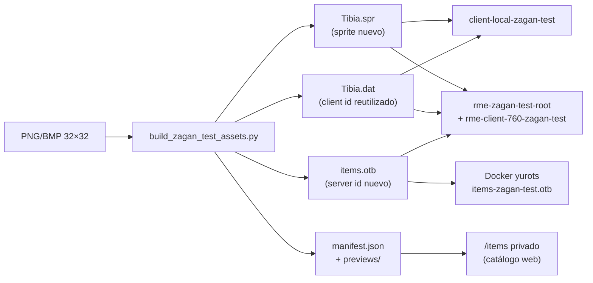

# De PNG (o BMP) a item en juego, RME y cliente

Guía completa del pipeline de YurOTS para convertir una imagen en un **item real**: visible en OTClient 7.6, reconocido por el servidor, equipable (si el prototipo lo es) y colocable en el **map editor (RME)**.

Este documento describe el flujo que hoy usa el entorno **Zagan test** (`items-zagan-test.otb`). Es el camino probado en este repo; no es la única forma posible en Tibia/OT en general, pero es la que está automatizada aquí.

---

## Resumen en una frase

**Una imagen → sprite en `Tibia.spr` → apariencia parcheada en `Tibia.dat` → entrada nueva en `items.otb` → copia a cliente test, RME test y servidor Docker.**

No se escribe lógica de equipamiento nueva: el item **hereda** slot, peso, flags y comportamiento de un **prototipo** existente (ej. steel helmet, serpent sword).

---

## Qué toca cada pieza



| Artefacto | Rol |
|-----------|-----|
| **`Tibia.spr`** | Guarda el bitmap del sprite (pixels 32×32). |
| **`Tibia.dat`** | Dice qué sprite usa cada **client id** (apariencia en cliente/RME). |
| **`items.otb`** | Define **server id**, **client id**, nombre, descripción, flags (equipable, stackable, etc.). |
| **`items.xml`** | Atributos extra (peso de runas, charges…). En el pack test se copia el XML base; los items nuevos viven en el OTB. |
| **`manifest.json`** | Índice humano: nombres, ids, rutas de preview. |

---

## Requisitos de la imagen

El builder (`scripts/build_zagan_test_assets.py`) acepta **PNG** o **BMP**.

| Regla | Detalle |
|-------|---------|
| Tamaño | **32×32** píxeles (si no, se reescala con LANCZOS). |
| Transparencia | PNG con alpha, o fondo **magenta** `RGB(255,0,255)`, o negro puro `RGB(0,0,0)` → todo eso se vuelve transparente en el `.spr`. |
| Evitar | Sombras con alpha parcial: el encoder 7.6 solo distingue visible / invisible. |
| Tipo de item | **Un sprite**, item estático. No outfits, no criaturas, no objetos multi-tile. |
| Prototipo | Debe ser un item del OTB base con **exactamente 1 sprite** en el `.dat`. |

---

## Camino A — Un PNG suelto (el caso típico “me pasaron un PNG”)

### 1. Preparar el PNG

1. Dejar el arte en **32×32** (mejor sin reescalar automático).
2. Fondo transparente o magenta/negro para recorte.
3. Guardar en:

```
zagan-test/custom-sprites/mi_item.png
```

Ejemplos reales en el repo: `fox_machina_helmet.png`, `chillan_shield.png`.

### 2. Declarar el item en el builder

Editar `CUSTOM_ITEM_DEFS` en `scripts/build_zagan_test_assets.py`:

```python
CUSTOM_ITEM_DEFS: tuple[tuple[str, str, int, str], ...] = (
  # (archivo, nombre, prototype_server_id, descripción)
  (
    "mi_item.png",
    "nombre visible del item",
    2457,  # ej. steel helmet → slot casco
    "Descripción que verá el jugador.",
  ),
)
```

**Elegir bien el `prototype_server_id`**: define slot y comportamiento.

| Querés… | Prototipo típico (server id) | Item de referencia |
|---------|------------------------------|-------------------|
| Espada | `2409` | serpent sword |
| Daga | `2383` | dagger |
| Hacha | `2386` | — |
| Maza / martillo | `2391` / `2398` | war hammer / morning star |
| Lanza | `2414` | — |
| Arco | `2456` | — |
| Ballesta | `2455` | — |
| Escudo | `2515` | guardian shield |
| Casco | `2457` | steel helmet |
| Armadura | `2476` | knight armor |
| Piernas | `2477` | knight legs |
| Botas | `2643` | — |
| Amuleto | `2197` | — |
| Runa | `2260` | blank rune |
| Anillo / misc | `2168` | — |

Lista completa de prototipos en `server/YurOTS/ots/data/items/items.otb` o en el editor de items de RME.

### 3. Reconstruir e instalar

```bash
./scripts/install-zagan-test-env.sh
```

Eso hace, en orden:

1. `build_zagan_test_assets.py` — genera `.dat`, `.spr`, `.otb`, previews, `manifest.json`
2. `sync-zagan-items-web.py` — actualiza catálogo privado `/items`
3. Copia assets al **cliente test**, **RME test** y `items-zagan-test.otb/xml` al servidor
4. **Reinicia Docker** si `yurots` está corriendo (el OTB solo se carga al arranque)

### 4. Ver ids asignados

```bash
cat zagan-test/manifest.json | tail -30
# o buscar por nombre:
python3 -c "import json; m=json.load(open('zagan-test/manifest.json')); print([x for x in m if 'mi item' in x['itemName']])"
```

Cada entrada tiene:

- **`serverId`** — el que usás en GM: `/i 20154 1`
- **`clientId`** — id interno del cliente (no lo uses en `/i`)
- **`spriteId`** — posición en el `.spr`
- **`preview`** — PNG de vista previa en `zagan-test/previews/`

Los server ids empiezan en **`20100`** y suben automáticamente.

### 5. Probar en cliente

```bash
./scripts/play-zagan-test-client.sh
```

Login test: cuenta `275783`, pass `123456qa`, personaje **GM Kaiser**.

En el juego:

```
/i <serverId> 1
```

Siempre con cantidad al final.

### 6. Probar en map editor (RME)

```bash
./scripts/open-rme-zagan-test.sh
```

RME usa:

- Binario: `rme-zagan-test-root/build/rme`
- Sprites: `rme-client-760-zagan-test/Tibia.dat` + `.spr`
- Items: `rme-zagan-test-root/data/760/items.otb` (copia del test OTB)

En la paleta de items deberías ver el nombre del item nuevo. Si ves el sprite pero no el nombre, revisá que el OTB de RME sea el test (`cmp zagan-test/server-items/items.otb rme-zagan-test-root/data/760/items.otb`).

### 7. Probar en servidor local completo

```bash
./scripts/start-local-zagan-test.sh
```

Levanta Docker con:

```bash
YUROTS_ITEMS_OTB=data/items/items-zagan-test.otb
YUROTS_ITEMS_XML=data/items/items-zagan-test.xml
```

---

## Camino B — Muchos BMP de un pack (Zagan+Square)

Para decenas de sprites de una carpeta:

1. Poner los `.bmp` en la carpeta fuente (hoy: `~/Downloads/Zagan+Square/`; configurable con `SOURCE_DIR` en el builder).
2. Opcional: mapear nombre de archivo → nombre + prototipo en `BMP_ITEM_DEFS`.
3. Si no está en el mapa, el script infiere prototipo por palabras clave (`sword`, `shield`, `helm`…) con `infer_prototype()`.
4. Correr `./scripts/install-zagan-test-env.sh`.

Los 5 primeros del pack tienen client ids **reservados** fijos: `5080`, `5086`–`5089`. El resto obtiene ids reutilizados automáticamente.

---

## Qué hace el builder por dentro (cada imagen)

Para cada `ItemSpec` (PNG o BMP):

1. **Carga la imagen** → RGBA 32×32, fondo magenta/negro → transparente.
2. **Elige un client id reutilizable** dentro del rango válido del cliente 7.6 (`100` … `item_count`, hoy `5089`).
   - No incrementa `item_count` del `.dat` (incrementarlo rompe outfits y el cliente no carga).
   - Parchea el sprite de ese client id en el `.dat` con la apariencia del prototipo pero apuntando al sprite nuevo.
3. **Appendea el sprite** al final del `.spr` (`spriteId` nuevo).
4. **Appendea un nodo** al `items.otb` base:
   - `serverId` nuevo (≥ `20100`)
   - `clientId` asignado
   - `name` / `description`
   - flags del prototipo (arma, escudo, equipable, etc.)
5. **No borra** las filas viejas del OTB que usaban ese client id (los tiles del mapa siguen resolviendo sus server ids antiguos).
6. **Genera preview** PNG en `zagan-test/previews/`.

---

## IDs: server vs client (muy importante)

| Id | Quién lo usa | Ejemplo |
|----|--------------|---------|
| **Server id** | Servidor, mapa `.otbm`, `/i`, scripts | `20100` |
| **Client id** | OTClient, RME (apariencia) | `5080` |

**En el juego siempre spawnear por server id:**

```
/i 20100 1   ✓
/i 5080 1    ✗ (no es server id)
```

### Por qué no usar client ids 5100+

OTClient 7.6 solo reconoce client ids hasta `item_count` del header del `.dat` (5089). Ids mayores existen en archivo pero el cliente los rechaza → **desconexión** al ver el item.

Por eso el pipeline **reutiliza** slots viejos de 1 sprite en lugar de subir `item_count`.

---

## Archivos y carpetas del entorno test

| Ruta | Uso |
|------|-----|
| `scripts/build_zagan_test_assets.py` | Builder principal |
| `scripts/install-zagan-test-env.sh` | Build + copia + restart servidor |
| `scripts/play-zagan-test-client.sh` | Cliente `client-local-zagan-test` |
| `scripts/open-rme-zagan-test.sh` | Map editor aislado |
| `scripts/start-local-zagan-test.sh` | Docker + cliente |
| `scripts/sync-zagan-items-web.py` | Catálogo web privado |
| `zagan-test/manifest.json` | Índice de todos los items |
| `zagan-test/previews/` | Miniaturas |
| `zagan-test/custom-sprites/` | PNGs propios |
| `client-local-zagan-test/data/things/760/` | `.dat` / `.spr` del cliente |
| `rme-client-760-zagan-test/` | `.dat` / `.spr` para RME |
| `rme-zagan-test-root/` | RME + `data/760/items.otb` |
| `server/.../items-zagan-test.otb` | OTB que carga Docker (con env vars) |

---

## Catálogo web privado `/items`

Para ver todos los items con imagen, ids y comando de spawn sin entrar al juego:

```bash
./scripts/web.sh
# → http://localhost:8080/items
```

- Requiere token (`web/.items-admin-token`, generado automáticamente en local).
- No está enlazado desde la web pública.
- API e imágenes devuelven **404** sin token.

En VPS: `Environment=ITEMS_ADMIN_TOKEN=...` en `scripts/yurots-web.service`.

---

## Checklist después de agregar un PNG

- [ ] Preview OK en `zagan-test/previews/`
- [ ] Entrada correcta en `zagan-test/manifest.json`
- [ ] Servidor reiniciado tras `install-zagan-test-env.sh`
- [ ] Cliente test abierto (no el `client-local` base)
- [ ] `/i <serverId> 1` funciona sin desconexión
- [ ] Item visible y con nombre en RME
- [ ] (Opcional) Visible en `/items` con token

---

## Problemas frecuentes

### Me kickea / se cae el cliente al crear el item

1. **Servidor con OTB viejo en memoria** — el OTB solo se carga al arranque. Corré `./scripts/install-zagan-test-env.sh` (reinicia Docker) o `docker compose restart yurots` con las env vars Zagan.
2. **Cliente base en vez del test** — usar `client-local-zagan-test`, no `client-local`.
3. **Varios OTClient abiertos** — misma cuenta → “Replacing active session” y desconexiones.
4. **Client id inválido en logs** (`unable to create item with invalid id 5100`) — desincronización servidor/cliente; rebuild + restart.

### El item no aparece en RME

- Confirmar `rme-zagan-test-root/data/760/items.otb` = `zagan-test/server-items/items.otb`
- Confirmar que RME apunta a `rme-client-760-zagan-test/` (script `open-rme-zagan-test.sh`)

### `/i` no hace nada

- Usar **server id** del manifest, no client id.
- Siempre incluir cantidad: `/i 20100 1`

### Error al build: prototipo no es 1 sprite

Elegir otro `prototype_server_id` cuyo item en el `.dat` tenga un solo sprite.

### Error: no hay suficientes client ids reutilizables

Hay ~2100 slots de 1 sprite sin `actions.xml`; si se agotan, habría que liberar más ids o reducir items. Hoy el pack tiene 54 items.

---

## Llevar items al servidor de producción (futuro)

El entorno actual es **test aislado** (`items-zagan-test.otb`). Para producción haría falta, como mínimo:

1. Merge controlado al `items.otb` principal (o sustitución planificada).
2. Regenerar `.dat`/`.spr` del **cliente de producción** (no solo el test).
3. Redistribuir cliente a jugadores.
4. Verificar que ningún tile crítico del mapa use server ids cuyos sprites fueron reemplazados en el client id reutilizado.

Eso no está automatizado en este repo; el flujo documentado aquí es el **sandbox Zagan**.

---

## Referencia rápida de comandos

```bash
# Agregar PNG → rebuild todo
./scripts/install-zagan-test-env.sh

# Solo cliente
./scripts/play-zagan-test-client.sh

# Solo map editor
./scripts/open-rme-zagan-test.sh

# Servidor + cliente local
./scripts/start-local-zagan-test.sh

# Ver catálogo con imágenes (privado)
./scripts/web.sh
# → http://localhost:8080/items

# Ver todos los ids
cat zagan-test/manifest.json
```

---

## Documentos relacionados

- `docs/ZAGAN_TEST_ITEMS.md` — resumen corto del pack actual
- `docs/ZAGAN_TEST_HANDOFF.md` — notas técnicas para otra IA (parcialmente desactualizado en nombres)
- `web/.items-admin-token.example` — token para `/items` en producción

---

## Ejemplo mínimo completo (PNG nuevo)

```bash
# 1. Copiar arte
cp ~/Downloads/espada_custom.png zagan-test/custom-sprites/espada_custom.png

# 2. Editar scripts/build_zagan_test_assets.py → CUSTOM_ITEM_DEFS:
#    ("espada_custom.png", "ember crown blade", 2409, "Forged in ember light.")

# 3. Build + deploy
./scripts/install-zagan-test-env.sh

# 4. Ver id asignado
grep -A6 ember zagan-test/manifest.json

# 5. Probar
./scripts/play-zagan-test-client.sh
# En juego: /i 20154 1   (el número real sale del manifest)
```

Ese es el ciclo completo: **imagen → item en servidor, cliente, RME y catálogo web.**
